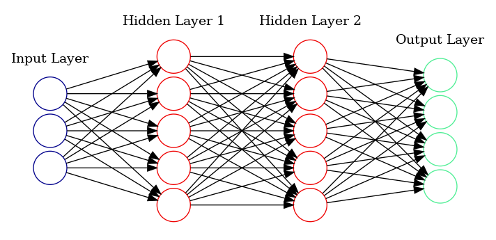
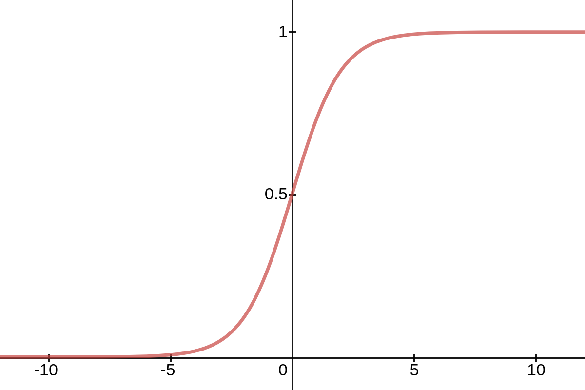

A foundational piece to learning artificial intelligence is understanding the architecture of neural networks. Many are frightened by the "complexity" of this topic but in fact, neural networks aren't that complicated. This post aims to demystify neural networks by providing an intuitive and comprehensive tutorial on the inner workings of neural networks.

This post is intended for beginners with no previous experience in artificial intelligence but should also provide value to even those who already have a solid background in this field. We'll be going over the inner workings of neural networks as well as programming them from scratch in python.

**Let's get started!**
{: .text-center}

## What is a Neural Network?
```Neural Networks(NN)``` are sets of interconnected neurons that take in a large set of data and aim to discover an underlying pattern. While neural networks don't exactly emulate our biological neural networks, they are ```loosely inspired``` by how our brains learn.

Our brain doesn't learn concepts instantly, it usually takes different iterations of explanations and even trial and error to solidify our understanding of an idea. Imagine if you had no understanding of what cats and dogs were. If I showed you thousands of different pictures of cats and dogs, you would start to form an understanding and eventually you would become more confident in telling me which pictures were cats and which were dogs. While oversimplified, this is the basis of how neural networks learn.

Now that you have a high level overview of how neural networks learn, let's dive deeper and take a look at their structure.

{: .align-center}

Above, we can see an example image. The neural network is composed of 3 types of layers:
- **Input Layer**—This is the input of our network where we pass in our data(This could be text, images, sound, etc.) 
- **Hidden Layer**—This layer falls in between the input and output layers. It does the mapping between the input and output layers by performing a series of mathematical operations
- **Output Layer**—This can be seen as the results of our network

> The term "deep learning" comes from neural networks with more than 1 hidden layer. These types of neural networks are called deep neural networks. The neural network figure above displays a deep neural network because it contains 2 hidden layers. Neural networks with only 1 hidden layer can be referred to as simple neural networks.

## What is the function of the neuron?
Each neuron performs a set of mathematical operations to derive an output.

{: .align-center}

Above is an example of a randomly selected neuron. Each neuron will have a connection with every neuron in the previous layer. The way each neuron obtains its value is simple. It begins by summing up every input. The input consists of the input value(x) as well as an associated weight(w). When the model is trained, these weights shift around in order to get the optimal model. The weights carry influence as to how strong a connection between two neurons are. The higher the weight the influence of the neuron. 

$$x\cdot w = (x_1\times w_1) + (x_2\times w_2) + ... + (x_n\times w_n)$$

Above we summed up every input which consisted of the input multiplied by the weight. We can further simplify this as the summation equals the dot product of the vectors x and w.

Furthermore, we also have to add the bias(b) term to transpose the constant value to obtain the output values.

$$x\cdot w + b$$

Finally, to obtain the neurons output value, we pass it through an activation function in order to introduce non-linearity into the neurons output. Without the activation function, our neural network is essentially a linear regression model[1]. With the activation function, our model is able to learn more complex tasks. There are several activation functions, but in this post we will be going over the **sigmoid activation function**.

{: .align-center}

To determine the output, the sigmoid activation function looks at the value obtained and the larger the value, the closer it will be to 1. The smaller the value, the closer it will be to 0. This allows us to have output between 0 and 1 with some values carrying more weight than others.


$$\frac{1}{1+e^{-z}}$$

Above we can see the sigmoid activation function equation where z is $x\cdot w + b$.

The steps outlined above occur through every neuron in the neueral network until the network reaches its end. This process of passing data through the neural network is called **forward propogation**. Once this process is completed we move on to backpropogation.

## What is backpropogation?

**Back-propagation** fine tunes the model based on the results of forward propogation every iteration. After a forward pass, the neural network calculates the loss function and propogates those results backwards to tune the weights and biases. Since the model is updating its weights and biases every iteration, the model should become more optimized. The goal is to lower this error rate.

> The loss function is highly related to the cost function however, the loss function refers to the error of one training sample, while the cost function is the average of the entire training set[2].

The loss function we'll be looking at is **mean squared error(MSE)**. 


## References
[1] [Activation functions in Neural Networks](https://www.geeksforgeeks.org/activation-functions-neural-networks/)
[2] [A Gentle Introduction To Math Behind Neural Networks](https://towardsdatascience.com/introduction-to-math-behind-neural-networks-e8b60dbbdeba)


