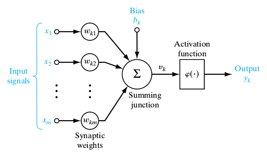

A foundational piece to learning artificial intelligence is understanding the architecture of neural networks. Many are frightened by the "complexity" of this topic but in fact, neural networks aren't that complicated. This post aims to demystify neural networks by providing an intuitive and comprehensive tutorial on the inner workings of neural networks.

This post is intended for beginners with no previous experience in artificial intelligence but should also provide value to even those who already have a solid background in this field. We'll be going over the inner workings of neural networks as well as programming them from scratch in python.

**Let's get started!**
{: .text-center}

## What is a Neural Network?
```Neural Networks(NN)``` are sets of interconnected neurons that take in a large set of data and aim to discover an underlying pattern. While neural networks don't exactly emulate our biological neural networks, they are ```loosely inspired``` by how our brains learn.

Our brain doesn't learn concepts instantly, it usually takes different iterations of explanations and even trial and error to solidify our understanding of an idea. Imagine if you had no understanding of what cats and dogs were. If I showed you thousands of different pictures of cats and dogs, you would start to form an understanding and eventually you would become more confident in telling me which pictures were cats and which were dogs. While oversimplified, this is the basis of how neural networks learn.

Now that you have a high level overview of how neural networks learn, let's dive deeper and take a look at their structure.

{: .align-center}
*Figure 1 — Neural Network*

Above, we can see two example images. Both neural networks are composed of 3 types of layers:
- **Input Layer**—This is the input of our network where we pass in our data(This could be text, images, sound, etc.) 
- **Hidden Layer**—This layer falls in between the input and output layers. It does the mapping between the input and output layers by performing a series of mathematical operations
- **Output Layer**—This can be seen as the results of our network

> The term "deep learning" comes from neural networks with more than 1 hidden layer. These types of neural networks are called deep neural networks. Figure 1 displays a deep neural network because it contains 2 hidden layers. Neural networks with only 1 hidden layer can be referred to as simple neural networks.

## What is the function of the neuron?
Each neuron performs a set of mathematical operations to derive an output.


*Figure 2 — Neuron*{: .align-center}


## Nueral Networks Process
Now that we understand what a neural network is, let's take a look at how it actually functions.


